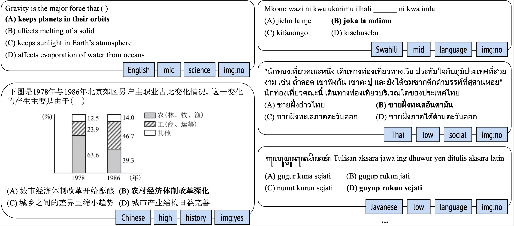

# M3Exam: A Multilingual 🌏, Multimodal 🖼, Multilevel 📈 Benchmark for LLMs

This is the repository for [M3Exam: A Multilingual, Multimodal, Multilevel Benchmark for Examining Large Language Models](https://arxiv.org/pdf/2306.05179.pdf).

TL;DR: We introduce M3Exam, a novel benchmark sourced from real and official human exam questions for evaluating LLMs in a multilingual, multimodal, and multilevel context.




## Data
### Access the data
* You can download the data from [here](https://cutt.ly/m3exam-data).
* The downloaded folder will be encrypted (to prevent some automatic crawling scripts). Please get the password from the bottom of this page.
* After unzipping the file, you will see the following file structure:
```
data/
    multimodal-questions/         <- questions requiring images
        xx-questions-image.json   <- file containing the questions, xx is a language
        iamges-xx/                <- folder containg all the images for xx
    text-questions/               <- questions with pure text
        xx-questions-dev.json     <- held-out data (e.g., can be used as in-context examples)
        xx-questions-test.json    <- main test data for evaluation
```

### Data format
* Questions are stored in json format, you can read each json file to check the data. For example:

```python
with open(f'./data/text-question/{lang}-questions-dev.json', 'w') as f:
    data = json.load(f)  # data is a list of questions
```

* Each question is stored in json format:

```
{
    'question_text': 'Which Civil War event occurred first?',
    'background_description': [],
    'answer_text': '2',
    'options': ['(1) battle of Gettysburg',
    '(2) firing on Fort Sumter',
    '(3) assassination of President Lincoln',
    '(4) Emancipation Proclamation'],
    'need_image': 'no',
    'language': 'english',
    'level': 'mid',
    'subject': 'social',
    'subject_category': 'social-science',
    'year': '2006'
}
```


## Evaluation
* first you need to fill in your OpenAI API key in the bash files:
```
python main.py \
--setting zero-shot \
--model chat \
--use_api \
--selected_langs "['english']" \
--api_key #put your key here
```
* then you can quickly check by running `quick_run.sh`, which will run on 10 English questions and produce `english-pred.json` in the corresponding output folder
* to evaluate, you can also run `eval.sh` to check the performance on this 10 examples!
* to run on more data, you can refer to `run.sh` for more detailed settings
```
python main.py \
--setting zero-shot \
--model chat \
--use_api \
--selected_langs "['english']" \
--selected_levels "['low', 'mid', 'high']" \
--num_samples all \
--api_key #put your key here
```
    * specify the languages you want to run through `--selected_langs`
    * running on all questions, set `--num_samples all`


## Citation
If you find this useful in your research, please consider citing it:
```
@article{zhang2023m3exam,
      title={M3Exam: A Multilingual, Multimodal, Multilevel Benchmark for Examining Large Language Models},
      author={Wenxuan Zhang and Sharifah Mahani Aljunied and Chang Gao and Yew Ken Chia and Lidong Bing},
      year={2023},
      eprint={2306.05179},
      archivePrefix={arXiv},
      primaryClass={cs.CL}
}
```

password: 12317